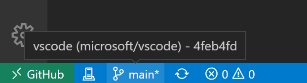

> [!IMPORTANT]
> **Already reading this in an Exercise issue or your own private copy? The copy is already created.** Do not create another repository. Skip only the copy-creation substeps below; continue with cloning/opening **this existing copy**, account checks and the first edit. If Git or desktop VS Code is not installed, use [the installation guide](../../docs/toolchain.md) before cloning.

## Laboratory 02 - Step 1/4

### Decide what the reusable network boundary owns

| Before you begin | This step |
| --- | --- |
| Goal | Set up this independent copy and explain a network-only reusable module boundary. |
| Time | 25–35 minutes including first-time setup and the design decision. |
| Files | Edit [exercise/design.md](../../exercise/design.md); read [variables.tf](../../variables.tf) and [versions.tf](../../versions.tf) without changing them. |
| Starting branch | Your copy's actual default branch, normally `dev`; create `lab/network`. |

Beginner guides: [Start here](../../docs/start-here.md) · [Git workflow](../../docs/git-workflow.md) · [Copilot guide](../../docs/copilot-guide.md) · [Toolchain](../../docs/toolchain.md) · [Troubleshooting](../../docs/troubleshooting.md).

> [!NOTE]
> No Lab 01 repository, review, or result is required. This copy supplies typed inputs, provider requirements, lockfiles, and root mocks.
> The learner root stops at a VNet and subnets; it does **not** compose the security module in this laboratory.
> Windows/Linux shortcuts are shown; on macOS use Cmd+P, Cmd+S, Cmd+Shift+P, and the Source Control icon.

### 1. Make your own private copy with the correct browser account

1. Sign in to GitHub; use the profile-picture menu to verify your invited personal account and accept the appropriate invitation.
2. Open [alvinea28/ws2-network-module-laboratory-02](https://github.com/alvinea28/ws2-network-module-laboratory-02).
3. Select **COPY EXERCISE**, or **Use this template** → **Create a new repository**.
4. Select the authorized **Owner**, choose a unique name ending in `laboratory-02`, select **Private**, and leave **Include all branches** unchecked.
5. Select **Create repository** and confirm the new page identifies **your copy** with a **Private** badge, not the public source.
6. Wait for startup automation, refresh, and open the **Exercise** link on the landing page or the existing Exercise under **Issues**.


*REFERENCE — GitHub publisher screenshot, CC BY 4.0. Example labels are not your repository; [attribution](../../docs/images/NOTICE.md).*

### 2. Clone and open this copy, not the multi-repository parent

1. In **your copy**, select **Code** → **HTTPS** and copy its credential-free clone URL.
2. Open desktop VS Code, press **Ctrl+Shift+P** → **Git: Clone**, paste **your own copy URL**, and press **Enter**.
3. If prompted, select **Allow** for the sign-in you initiated and check the correct personal GitHub account on the trusted browser authorization page.
4. Authorize the recognized VS Code request and return through **Open Visual Studio Code**; complete a separate Git Credential Manager browser flow only if requested.
5. Choose a local **parent folder**, select **Select as Repository Destination**, then **Open** when cloning finishes.
6. Trust only this known-source clone. If **Explorer** shows a parent containing several labs, use **File** → **Open Folder...** to select the clone itself.
7. Do not work in the public template clone, a ZIP, the authoring multi-repo workspace, or `github.dev`; this route needs a local terminal and Git clone.


*REFERENCE — Microsoft publisher screenshot, CC BY 3.0 US. Microsoft example repositories are not your own copy; [attribution](../../docs/images/NOTICE.md).*

### 3. Verify accounts and tools before creating the branch

1. Open **Accounts** in VS Code and check the intended GitHub personal account independently of the browser login.
2. Use **Sign in with GitHub to use GitHub Copilot** when needed, then **Manage Extension Account Preferences...** to select the Copilot account.
3. Confirm the assigned Copilot seat/entitlement with the instructor; a successful clone does not establish that entitlement.
4. Follow [repository-local authorship setup](../../docs/start-here.md#set-authorship-only-for-this-repository) and the pinned [toolchain guide](../../docs/toolchain.md).
5. Select **Terminal** → **New Terminal**, verify the clone root, and run the following one line at a time:

```powershell
node --version
terraform version
node scripts/doctor.mjs
```

Expect Node **24.16.0** and Terraform **1.16.1**; the supplied provider requirement and lock select AzureRM **5.4.0**.
Read every doctor `CHECK` before continuing. It does not authenticate, install tools, check a Copilot seat, or prove push access.
If the doctor or shared setup pages are absent, ask for the complete numbered package; do not fabricate a successful setup.


*REFERENCE — Microsoft publisher screenshot, CC BY 3.0 US. Its example account state is not your sign-in or entitlement; [attribution](../../docs/images/NOTICE.md).*

### 4. Create the branch and read the supplied contract

1. Press **Ctrl+Shift+G** for **Source Control**, confirm the correct repository and a clean working tree, and select the actual default branch, normally `dev`.
2. Use **...** → **Pull** while clean to receive any AgentAlvine landing-page commit.
3. Press **Ctrl+Shift+P** → **Git: Create Branch...**, enter `lab/network`, and press **Enter**; verify the status-bar name.
4. If this branch already exists, select it rather than create a spelling variant.
5. Press **Ctrl+P** → [variables.tf](../../variables.tf), then **Ctrl+P** → [versions.tf](../../versions.tf); read them without edits.

| Supplied input | Contract to preserve |
| --- | --- |
| `name`, `resource_group_name`, `location` | Caller-selectable strings; the resource group already belongs to the caller. |
| `address_space` | Nonempty `list(string)` of syntactically valid IPv4 CIDRs. |
| `subnets` | `map(object({ address_prefixes = list(string) }))`; default stable keys are `web` and `data`. |
| `tags` | `map(string)` with nonblank `owner`, `environment`, `cost_center`, and `workshop`. |

Keep the complete types, defaults, validation blocks, version constraints, and provider lock unchanged.
Required-provider declarations select a dependency; they are not configured provider blocks or permission to access Azure.

### 5. Write a concrete reuse decision

1. Press **Ctrl+P**, enter [exercise/design.md](../../exercise/design.md), and press **Enter**.
2. Replace the unfinished text with your decision under **Reuse decision**. Adapt this example to your reasoning:

```markdown
# Reuse decision

The network baseline owns one VNet and named web/data subnets in an existing
resource group. Stable map keys allow another subnet without renumbering these two.

The subnet-security boundary owns an NSG, custom rules and associations, receiving
subnet IDs from its caller. It remains separate and is not composed in this lab.

The caller owns the existing resource group, configured provider, credentials and
state. None of those dependencies is created or discovered by this reusable root.

A broader Azure Verified Module candidate may cover more features and maintenance
needs. This small contract is easier to inspect for the workshop's limited scope;
that is a teaching choice, not AVM certification. Gateways are deliberately excluded.
```

3. Explain the comparison rather than claim you evaluated an external candidate you did not inspect.
4. Retain **Reuse decision**, **network baseline**, and **subnet-security** exactly; remove every `TODO` and press **Ctrl+S**.

> [!WARNING]
> Do not create a resource group, VM, gateway, provider configuration, backend, or security composition to support this decision.
> No Azure login, state access, or real plan/apply is permitted; mocked checks do not prove policy, overlap, or reachability.

### 6. Review, stage, commit, publish, and inspect feedback

1. Press **Ctrl+Shift+G**, select the design file under **Changes**, and read its full diff; verify input and lock files are unchanged.
2. Select **+** (**Stage Changes**), inspect **Staged Changes**, enter `lab: define the network reuse boundary`, and select **Commit**.
3. Select **Publish Branch** for this first push to your existing `origin`; use **...** → **Push** for later commits.
4. Refresh **your own copy** on GitHub, select `lab/network` under **Code**, and inspect its newest commit and design text.
5. Select **Actions** → **Lab checks** → the newest-commit run → **Test learner module** → the learner-check command log.
6. Read the first real error line: the network resources and outputs are still unfinished, so full learner CI is not expected to pass yet.
7. Inspect **AgentAlvine** → the relevant latest run → **guide** if needed, then refresh the Exercise **body** for the next task.


*REFERENCE — Microsoft publisher screenshot, CC BY 3.0 US. Its `main` label is not the required `lab/network` branch; [attribution](../../docs/images/NOTICE.md).*

### Expected result and what AgentAlvine checks

- A changed, pushed design contains the three named concepts and no `TODO`; it advances the design task without requiring finished Terraform yet.
- The final lab gate will execute the **learner root**, not award credit for reading a solution or running a reference copy.

### Troubleshooting

| Symptom | Specific recovery |
| --- | --- |
| Template notice instead of an Exercise | Verify you created and cloned a private copy; public source templates do not award participant progress. |
| Doctor reports the wrong folder or account setup | Reopen this clone alone and follow the linked setup guide; never initialize another repository inside it. |
| Design gate remains pending | Check exact required phrases, saved file, selected branch, and pushed commit; correct, save, review/stage/commit, then push. |
| Learner CI is red at this stage | Read its diagnostic, but do not remove tests or copy security code; finish the next two tasks. |

**Next action:** keep `lab/network` and open [Step 2: implement the VNet and subnets](02.md).
