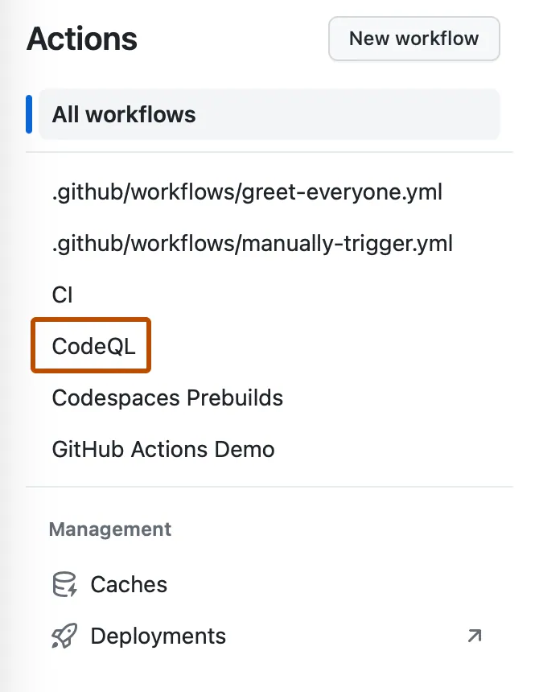

## Laboratory 02 - Step 4/4

### Prove the learner root with all four mocked cases

| Goal / workspace | This step |
| --- | --- |
| Goal | Validate your authored root and inspect matching current-commit CI. |
| Branch | `lab/network`; no PR/merge or empty commit required. |
| Files | Read [tests/network.tftest.hcl](../../tests/network.tftest.hcl); correct [main.tf](../../main.tf) / [outputs.tf](../../outputs.tf) only for genuine failures. |

[Independent setup](01.md) · [Toolchain](../../docs/toolchain.md) · [Git workflow](../../docs/git-workflow.md) · [Troubleshooting](../../docs/troubleshooting.md).

Use this clone's **learner root**, not a solution. Keep Node **24.16.0**, Terraform **1.16.1**, AzureRM **5.4.0**; no deployed VNet, subscription or earlier lab needed.

### 1. Inspect all four contracts

Read `mock_provider "azurerm"` and `override_during = plan`. Preserve every run; no solution redirection via test `module` or replacement with a live provider.

| Exact run name | What must happen |
| --- | --- |
| `valid_two_subnet_topology` | Return exactly `web` and `data` subnet keys and a non-null VNet ID. |
| `reject_invalid_cidr` | Reject `10.300.0.0/16` at `var.address_space`. |
| `reject_invalid_subnet` | Reject `not-a-cidr` in the subnet prefix list at `var.subnets`. |
| `reject_missing_tags` | Reject the map containing only `owner` at `var.tags`. |

A rejection passes only when the declared input validation rejects its bad value—not on authentication errors or arbitrary nonzero exits.

### 2. Run the offline checks in order

At the clone root, run separately; stop on unexpected errors. Commands work in PowerShell and macOS/Linux shells:

```powershell
terraform fmt -check -recursive
terraform init -backend=false -lockfile=readonly -input=false
terraform validate
terraform test
```

| Command / flag | Why |
| --- | --- |
| `fmt -check -recursive` | Checks formatting without rewriting; includes child folders. |
| `init -backend=false` | Installs dependencies without initializing a backend. |
| `-lockfile=readonly` | Keeps the supplied provider selections/checksums unchanged. |
| `-input=false` | Disables interactive prompts; missing inputs fail. |
| `validate` | Checks configuration and installed provider schema. |
| `test` | Executes the supplied provider-mocked runs against this root. |

**Expected output**, not a result already obtained:

```text
Success! 4 passed, 0 failed.
```

Confirm all four named runs actually execute. Their mocked `command = plan` does not authorize a standalone real plan.

### 3. Run CI's learner helper

Stay at the clone root:

```powershell
node scripts/check-learner.mjs
```

**Why:** repeats the checks above, inspecting mock structure and JSON results. Rejects missing, zero, skipped, failed or errored cases, not just bad exit codes.

**Expected output**, not evidence until observed:

```text
.: 4 provider-mocked tests passed; no Azure calls.
```

May download dependencies/prepare local Terraform data; no Azure credentials, OIDC, subscription selection or remote state.

### 4. Publish corrections and inspect current CI

Fix only diagnosed implementation/output mistakes; rerun the full helper and publish reviewed changes using the Git guide. Message: `lab: fix the learner network contract`. No empty commit.

Inspect **Actions → Lab checks → latest branch commit → Test learner module** and its actual four-test summary. Both workflow and job must succeed for that revision. Refresh the same Exercise after AgentAlvine finishes.


*REFERENCE — GitHub, CC BY 4.0; choose **Lab checks**, not example CodeQL. [Attribution](../../docs/images/NOTICE.md).*

**Expected:** **4/4** core progress from current learner-root CI, not old green runs, skipped source-template jobs, zero tests or local-only output. No PR/review/merge required.

**If not:** for `Unknown test file`/zero tests, remove accidental filters. Retain `expect_failures = [var.address_space]`. Ask about approved network/architecture for download failures; never weaken TLS, locks, inputs or assertions. Check pending progress against the observed SHA/guide feedback.

For these four offline steps: no Azure login, real plan/apply/destroy or state commands. Mocks do not prove policy, overlap or connectivity.

**Terraform AVM hands-on:** use the [separate AVM profile](../../avm/README.md), AzureRM **4.81.0**, not core **5.4.0**. Core mocks and historical **4/4** results do **not** complete/validate that profile. Keep configuration/state separate.

### Required live continuation — instructor-approved cohorts

The core above stays at **four steps**. Its **4/4** is not an AVM deployment, human approval or cleanup result, and AgentAlvine does not certify this additional lifecycle.

1. [Author the single AVM delivery workflow](../../docs/workflow-authoring.md) after completing the core. Copy the explained sections from the complete **non-runnable reference into an untitled buffer**, then replace the one canonical workflow as a complete file **while disabled**. Do not install partial drafts or a duplicate writer. Complete the documented workflow, Node, kit and companion checks; the original learner helper still checks this original root.
2. The instructor must separately complete [Lab 02's real delivery configuration](../../docs/delivery-configuration.md): approved private non-template copy, protected current `main`, eligible Enterprise hosting, main-only **avm-plan** / **avm-apply** environments, actual independent reviewers with no self-review/admin bypass, distinct OIDC identities, private backend connectivity and the exact-workflow trusted ephemeral runner. Keep `WORKSHOP_AZURE_ENABLED=false` throughout authoring; no Azure/identity/subscription/state operations or local live backend initialization. Missing gates mean **live continuation pending**, not simulated approval.
3. Only after real enablement, complete **main-push create → actual Azure configuration verification → benign HCL tag change and main-push update with the same IDs → fresh followup with exit 0 → explicit independently reviewed destroy and verified absence**. Main push starts the same-run **preflight → validation → plan → apply** chain; do not dispatch another deploy. Manual choices are only **followup** and **destroy**; scheduled drift is report-only. The root is fixed to AVM, with separate resources/state from Lab 07 and no import/adoption. Public `dev` stays inert.

No live stage is claimed by this lesson or its offline history. Optional runtime API extensions require separate real preflight; costs are not assumed zero. For approved live cohorts, complete the protected lifecycle before moving on; otherwise retain the explicit pending status.

**Next independent lab:** [Laboratory 03](https://github.com/alvinea28/ws2-subnet-security-laboratory-03) in a new private copy with its supplied security root; do not transfer this implementation or any state.
