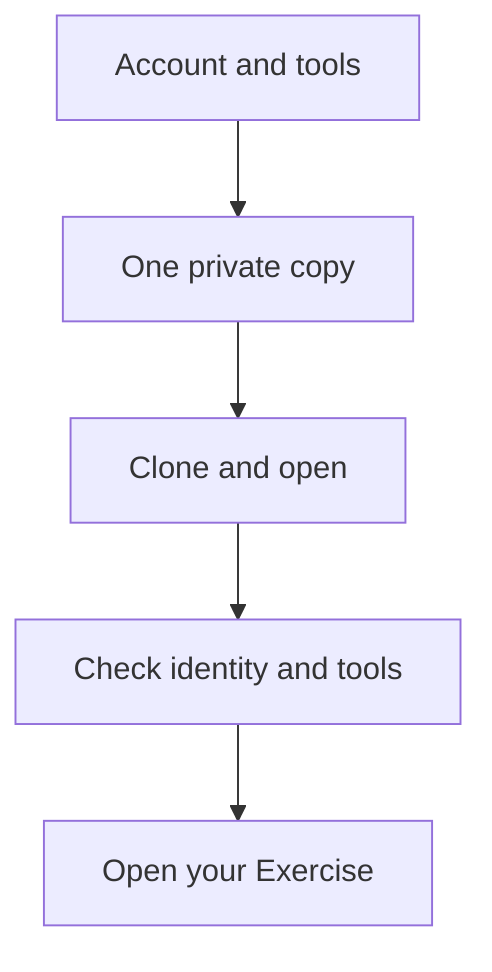

# Laboratory 02 — Full first-time setup

[Review index](README.md) · [Activity 01](activity-01.md) · [Simulation record](simulation.md)

> Review copy; follow your private copy’s live Exercise issue to do the lab.

<!-- FULL-WS-SETUP:START -->
# Start here: your first independent workshop lab

**Goal:** reach the current Exercise in **your own private copy** with working local tools. Each numbered lab supplies its own baseline; no earlier repository is required. Choose one in the [workshop catalogue](https://github.com/alvinea28/ws2-workshop-catalogue).

**Lab 02 boundary:** the four core steps remain credential-free and independent. Instructor-approved live cohorts must then complete the [AVM workflow-authoring continuation](../docs/workflow-authoring.md), after the [real instructor configuration prerequisite](../docs/delivery-configuration.md). Offline **4/4** is not Azure deployment or approval proof.

**Required activity: [Create GitHub Actions, then deploy Azure](../docs/workflow-authoring.md).**
Phase A is Actions authoring/checking offline in every copy. Phase B is the actual
Azure lifecycle, only for the exact approved private copy after owner readiness.

**Before cloning on Windows x64:** [prepare all eight labs with one command](https://github.com/alvinea28/ws2-workshop-catalogue/blob/dev/docs/windows-setup.md#2-paste-this-one-command).
It installs the tools and VS Code extensions once. After **READY**, reopen VS Code
and continue below; skip repeated manual installations. Personal sign-in, Copilot
entitlement and repository-local Git authorship remain separate steps.



Flow: prepare your account and tools, copy once, clone locally, check setup, then follow your Exercise.

> [!WARNING]
> Setup and issue progress never authorize Azure deployment. Keep PR checks free of credentials, OIDC and state. Do not initialize a real backend or run a real plan/apply during setup. Never share passwords, tokens, keys, recovery/device codes or state; use only trusted sign-in UI you initiated.

## Quick navigation

[Account](#prepare-your-github-account) · [Copy](#create-your-own-private-copy) · [Clone](#clone-your-copy-into-desktop-vs-code) · [Authorship](#set-authorship-only-for-this-repository) · [Tools](#check-installed-tools) · [Azure setup](#enter-your-azure-values-and-sign-in) · [Exercise](#open-the-current-exercise) · [Required live continuation](#required-live-continuation-for-approved-lab-02-cohorts)

## Understand the different accounts and places

| Check | Controls | Does not prove |
| --- | --- | --- |
| GitHub browser account | Copy, issues and PR actions | Git or Copilot sign-in |
| Git Credential Manager | Git HTTPS authentication | Copilot access |
| VS Code **Accounts** | Extension account choices | Every extension uses the same account |
| Copilot seat | Your personal account's Copilot access | Repository write or Azure permission |
| Git `user.name` / `user.email` | Commit authorship | Authentication |
| Repository **Owner** | Account/organization containing the copy | Who is signed in |
| Azure account, tenant, subscription, RG | Separate directory and assigned scope | Deployment approval |

An organization owns repositories; you still sign in as your **personal** account. Membership, write permission and a Copilot seat are separate grants. **Copy** creates a GitHub repository; **clone** downloads its history; **commit** records locally; **push** uploads commits. More terms: [glossary.md](../docs/glossary.md).

Windows/Linux use **Ctrl+Shift+P** for the Command Palette and **Ctrl+S** to save; macOS uses **Cmd** instead. Named menus remain available.

## Prepare your GitHub account

1. At [GitHub](https://github.com/), **Sign up** and verify email, or **Sign in**. Check your username in the profile menu so invitations reach the right person.
2. Accept the instructor's invitation and complete required SSO/MFA in the trusted browser. Confirm the permitted copy **Owner** and assigned Copilot seat; do not purchase access or change policy to unblock setup.
3. Install desktop VS Code and Git using [toolchain.md](../docs/toolchain.md) before cloning. **Expected:** the desktop editor opens and Git is available.

## Create your own private copy

**Already in your own copy or its Exercise? Skip copying; keep that same repository.**

1. On the selected numbered template, choose **COPY EXERCISE**, or **Use this template → Create a new repository**. This creates an independent copy, not a fork or ZIP download.
2. Choose your permitted **Owner**, a unique name retaining this lab's final two-digit number, and **Private**. Leave **Include all branches** unchecked unless instructed otherwise; select **Create repository**.
3. Check your owner/name, **Private** badge and default branch, normally `dev`. **Expected:** your own files; do not create or rename `main` to match a screenshot.


*REFERENCE — GitHub publisher examples, not participant evidence. CC BY 4.0; [sources and attribution](../docs/images/NOTICE.md).*

## Wait for AgentAlvine

1. Allow **20–60 seconds**, then refresh your copy's landing page and open **Exercise**, or find it under **Issues**. A busy Actions queue may take longer.
2. Keep the issue open: **expected** progress, a current task and next action in its **body**. AgentAlvine may appear as `github-actions[bot]`; it is not Copilot.

If missing, use [Exercise recovery](../docs/troubleshooting.md#agentalvine-or-the-exercise-is-missing). Do not invent another issue, manually tick progress, post check commands or rerun delivery jobs.

## Clone your copy into desktop VS Code

1. In **your private copy**, select **Code → HTTPS** and copy its credential-free repository URL. Check the owner/name; exclude tokens, issue paths and `/tree/` paths.
2. In desktop VS Code, open **Ctrl+Shift+P → Git: Clone** and paste that URL, or select your copy through **Clone from GitHub**. **Why:** work locally on your copy, not the public template or catalogue.
3. If prompted, authorize only the GitHub request you initiated, using the invited personal account in the trusted browser, then return to VS Code. Git Credential Manager may request its own browser sign-in; cancel unexpected terminal credential prompts instead of pasting a token.


*REFERENCE — Microsoft publisher examples, not participant evidence. CC BY 3.0 US; [sources and attribution](../docs/images/NOTICE.md). Select your copy and account, not the examples.*

## Open and trust only this clone

1. Choose a local **parent folder → Select as Repository Destination**, then **Open** the new child folder. Trust only this known workshop clone, not its whole parent.
2. Check **Explorer**: lab files must sit directly under this clone's root. If wrong, use **File → Open Folder...** (macOS: **Open...**), preferably in a separate window. A ZIP, multi-repository parent or `github.dev` window is not this local workflow.

## Check the terminal location and remote

Open **Terminal → New Terminal**, using PowerShell on Windows. Run each line separately and **stop on an error or mismatch**.

```powershell
Get-Location
git rev-parse --show-toplevel
git remote -v
```

On macOS/Linux, use the equivalent shell checks:

```bash
pwd
git rev-parse --show-toplevel
git remote -v
```

| Command | What it does / flags | Expected |
| --- | --- | --- |
| `Get-Location` | Reads PowerShell's current folder | This clone's root |
| `pwd` | Reads the macOS/Linux shell's current folder | This clone's root |
| `git rev-parse --show-toplevel` | `--show-toplevel` locates Git's root | Same root as Explorer |
| `git remote -v` | `-v` shows fetch/push URLs | Both `origin` URLs identify your private copy |

Reading a clone does not prove push permission. Verify the first **intended task push**, not an unrelated test commit.

## Set authorship only for this repository

1. At the clone root, replace both placeholders with your intended author name and GitHub-verified email, or the **exact noreply address** from GitHub **Settings → Emails**. Keep the quotes; never use credentials or invent a noreply address.
2. Run the setters, then read back both values. **Expected:** your chosen metadata, no placeholders; stop if either is missing.

```powershell
git config --local user.name "YOUR-DISPLAY-NAME"
git config --local user.email "YOUR-VERIFIED-OR-NOREPLY-EMAIL"
git config --local --get user.name
git config --local --get user.email
```

| Command | What it does / flags | Expected |
| --- | --- | --- |
| `git config --local user.name "YOUR-DISPLAY-NAME"` | Sets author name in **this repository only** (`--local`) | Success normally prints nothing |
| `git config --local user.email "YOUR-VERIFIED-OR-NOREPLY-EMAIL"` | Sets this repository's commit email | Success normally prints nothing |
| `git config --local --get user.name` | `--get` reads the local author name | Your chosen name |
| `git config --local --get user.email` | Reads the local author email | Your verified/noreply address |

These commands also work on macOS/Linux. They affect **new commits**, not existing authorship, and do not sign you in.

## Connect the correct Copilot account

1. Use VS Code **Accounts → Sign in with GitHub to use GitHub Copilot**, completing the trusted browser flow as your personal workshop account.
2. In **Accounts → Manage Extension Account Preferences...**, select that account for the available Copilot entries. **Expected:** usable access through the assigned seat/approved entitlement, not merely a successful clone. See [Copilot sign-in](../docs/copilot-guide.md#sign-in-and-select-the-copilot-account).

## Check installed tools

Follow [toolchain.md](../docs/toolchain.md) for official installers, architecture/PATH choices and version commands. All labs use **Git, desktop VS Code and Node.js 24.16.0**; **02–08** use **Terraform 1.16.1 / AzureRM 5.4.0**; **04 only** needs **terraform-docs 0.24.0**. Lab 01 needs no Terraform.

That AzureRM **5.4.0** selection belongs to the original core. Lab 02's [isolated AVM profile](../avm/README.md) keeps Terraform **1.16.1** but uses AzureRM **4.81.0**, AzAPI **2.12.0**, ModTM **0.3.5** and Random **3.9.1**, with separate locks/state. Do not downgrade the learner root or substitute providers to make the profiles match.

After installation/PATH changes, save, close **all** VS Code windows and reopen this clone. Do not reset global settings. Azure CLI is separate from the local doctor and mocks.

## Enter your Azure values and sign in

Follow [azure-setup.md](../docs/azure-setup.md) when completing attendee Azure setup: collect **your own** assigned tenant ID, subscription ID and **existing** resource-group name from the portal, enter them in one PowerShell session, verify the account, then read the group live.

**Expected:** `TenantAndSubscriptionMatched=True`, `ExistingResourceGroupReadable=True`, `ProvisioningPerformed=False`. These are expected flags, not already-collected evidence or deployment permission. Local values do not configure Actions/OIDC; never commit them or copy a CLI cache into PR jobs. Missing assignment? Ask the instructor, not another attendee.

This account setup is optional for Lab 02's offline core. Arrange any real account/RG reads with the instructor outside authoring; no Azure/identity/subscription/state operations are performed while writing the workflow. For Lab 02 Actions variables, OIDC and cleanup, use [Lab 02 delivery configuration](../docs/delivery-configuration.md), not the shared account guide's Lab 07 writer. Local sign-in neither configures nor replaces the two live identities.

## Run the read-only doctor

**What it does:** from this clone's root, checks the root, tools and Git authorship without installing or changing anything. Expect reported setup checks; stop on any problem or missing script and report an incomplete package rather than inventing a replacement.

```powershell
node scripts/doctor.mjs
```

It cannot verify browser sign-in, Git write permission, a Copilot seat or Azure readiness.

## Open the current Exercise

1. Refresh **your existing Exercise issue body**. Read its branch, file links, acceptance criteria and next action; starter failures may be intentional.
2. Follow [git-workflow.md](../docs/git-workflow.md) and the [approved learner checks](../docs/toolchain.md#run-only-the-approved-offline-checks). Return to the same issue after relevant pushes, checks, PRs or releases; do not copy every solution or submit evidence PRs/run IDs.

Labs **01/05** allow self-inspection and educational PR merges where rules permit. The exact approved private Lab 02 route also permits the author to merge after strict checks and resolved conversations, with zero required approving reviews, not GitHub self-approval. [Scoped automatic exact-plan delivery](../docs/delivery-configuration.md) has **no manual deployment reviewer**; sandbox/budget/bootstrap readiness and separate cleanup authorization remain required. Lab 07 has its own root/state/resources; never share or adopt its network. Public templates remain inert on dev.

| Problem | Smallest recovery |
| --- | --- |
| Wrong folder/remote | Reopen the own-copy clone; do not push |
| Account or seat mismatch | Correct only the affected account; ask the instructor about access |
| Missing tool/doctor/Exercise | Stop at that step; use [troubleshooting.md](../docs/troubleshooting.md) |

**Ready:** one private copy, correct clone, local authorship, intended Copilot account, matching tools, reviewed doctor output and the current Exercise.

## Required live continuation for approved Lab 02 cohorts

Finish the same **four** core steps first; their learner-root checks and automatic Exercise progression are unchanged. **Phase A — Actions authoring (offline):** [author the AVM delivery workflow](../docs/workflow-authoring.md) in an **untitled buffer**, copying and explaining the complete non-runnable reference section by section. Replace only the one canonical workflow as a whole file **while disabled**; do not install partial drafts or duplicate writers. Complete the documented offline checks before considering Azure. A generic copy can author/check, but cannot deploy.

The owner must verify the exact approved private non-template identity, scope/budget/lifetime and explicit bootstrap authorization, protected current main/strict checks, eligible Enterprise hosting, main-only **avm-plan / avm-apply** with **no Required reviewers** and no admin bypass, distinct OIDC, private locked separate state, encryption and the restricted ephemeral **Linux x64 ws2-trusted** runner. These are [admin prerequisites](../docs/delivery-configuration.md), not completed setup or live results. Keep `WORKSHOP_AZURE_ENABLED=false`. If main is absent, stop at the offline handoff; only after baseline/readiness review may the owner establish protected main while disabled. No PR into nonexistent main or unready creation. Never initialize live state locally or repin IDs/pins/toggle flags to make another copy eligible.

**Phase B — Azure lifecycle:** only when ready/enabled, the author merges a real checks-passing PR to protected main. Its push starts validation → saved plan/encryption → automatic exact-plan apply in the same run; no second deploy button, approvals API or reviewer wait. Complete **create → actual Azure verification → benign HCL tag/main-push update with the same IDs → fresh followup exit 0 → separately authorized full cleanup and verified absence**. Delivery's manual choice is **followup only**. The current authenticated repository admin separately authorizes owned-scope cleanup and dispatches [avm-cleanup.yml](../.github/workflows/avm-cleanup.yml), required string `authorization` = `destroy:1379147533:<current full main SHA>:<WS2_STATE_LOCK_ID>`, no operation input or independent cleanup reviewer. Retain the same state/concurrency/environments/identities and shared RG/backend/runner. Ordinary main never cleans up. Scheduled drift is report-only. No empty commit or fake change merely to trigger deployment; source maintenance stays on **dev**, not participant live main.

Missing prerequisites mean **core complete; live continuation pending**, not permission to fabricate authorization or claim deployment from **4/4**. AgentAlvine only observes/guides; progress is not Azure authorization. Optional runtime API extensions remain blocked until separate real preflight; costs are not assumed zero. No live execution is claimed by these instructions.
<!-- FULL-WS-SETUP:END -->

[Continue to Activity 01](activity-01.md) · [Return to the review index](README.md)
