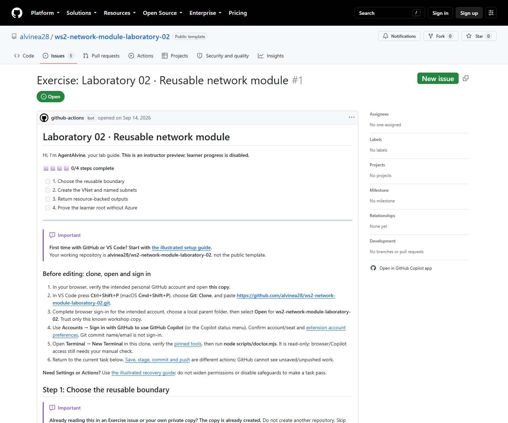

# Laboratory 02 — Full workshop review

> Review copy; follow your private copy’s live Exercise issue to do the lab.

[Full first-time setup](00-start-here.md) · [Enter your Azure values and sign in](azure-setup.md) · [Original simulation summary and verification limits](simulation.md) · [Repository landing page](../README.md)

Four complete [course lessons](../.github/agentalvine/course.json), with only relative links outside code fences rebased. The table records **2026-09-08 private simulations**, not your progress or a deployment.

| Activity | Full lesson | Cycle A | Cycle B |
| --- | --- | --- | --- |
| 01 | [Choose the reusable boundary](activity-01.md) | Recorded verified | Recorded verified |
| 02 | [Create the VNet and named subnets](activity-02.md) | Recorded verified | Recorded verified |
| 03 | [Return resource-backed outputs](activity-03.md) | Recorded verified | Recorded verified |
| 04 | [Prove the learner root without Azure](activity-04.md) | Recorded verified | Recorded verified |

Both cycles reached **4/4 core offline completion**. Whole-lab counts are not per-activity tests or deployment proof. [Private original proof](https://github.com/alvine-aurelio-org/ws2-public-rebuild-20260908-evidence/blob/dev/full-ws-content/lab-02/README.md) requires organization access.

**Terraform AVM hands-on:** [separate AVM profile](../avm/README.md), AzureRM **4.81.0**. The custom core stays on **5.4.0**; its mocks and historical **4/4** do **not** complete/validate AVM. Keep configuration/state separate.

## The Exercise issue is the learner guide

1. Copy once from the [landing page](../README.md), then clone/open using [setup](00-start-here.md). Use **your copy's README Exercise link**, not the source Preview.
2. Follow the current issue body and [Git guide](../docs/git-workflow.md). Publish the learner design/resources/outputs; incomplete intermediate CI can fail legitimately. Lab 02 requires no additional PR/review/merge.
3. Inspect **Lab checks → current commit → Test learner module**: all four root mock cases must execute successfully, including rejections. AgentAlvine uses GitHub Actions to update the **same Exercise body** automatically.

Checks need no Azure credentials, OIDC or state. Manual boxes, success comments and screenshots award nothing; progress never authorizes Azure. The [catalogue](https://github.com/alvinea28/ws2-workshop-catalogue) is navigation only.

## Public source preview — read only, not your learner issue

[Source Exercise #1](https://github.com/alvinea28/ws2-network-module-laboratory-02/issues/1) was observed on **2026-09-14** as a successful read-only Preview at **step 0, 0/4**. It is neither an A/B learner issue nor your copy's issue.

*Actual 2026-09-14 public Preview capture, not September 8 participant proof. [Provenance](images/provenance.json) records its timestamp and PNG hash.*

Separate [2026-09-14 local verification](simulation.md#fresh-2026-09-14-verified-results) is command-output evidence, not participant progress.

## If your private copy's Exercise is missing

Refresh your copy's README/Issues; inspect **Actions → AgentAlvine** and [recovery](../docs/troubleshooting.md#agentalvine-or-the-exercise-is-missing).

**Recovery only:** choose **Actions → AgentAlvine → Run workflow → Check progress** on your copy's actual default branch, normally `dev`, to reconcile its guide. Never select Preview in a learner copy, fake an Exercise, widen permissions, bypass protection or dispatch delivery.
