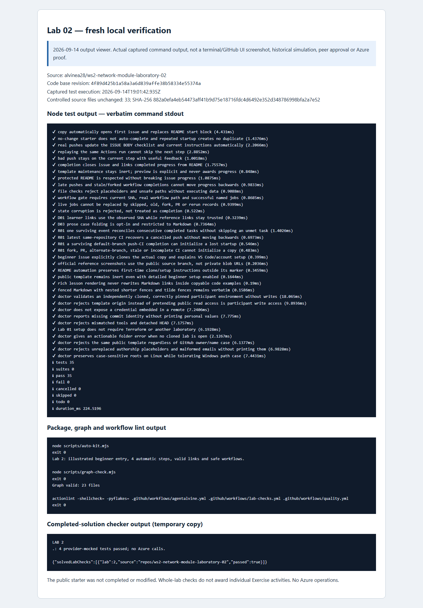

# Laboratory 02 — Recorded simulations and review evidence

[Review index](README.md) · [Full setup](00-start-here.md) · [First activity](activity-01.md)

## Original participant cycles — 2026-09-08

These are the preserved **Revision 4 Cycle A and Cycle B** results, not fresh tests and not the public source Preview. The [original public maintenance summary](../docs/daily%20work%20report/2026-09-08.md) reports the same whole-lab counts.

| Original cycle | Exercise progress | Whole-lab Node tests passed | Mocked cases/fixtures passed | Scope |
| --- | --- | --- | --- | --- |
| A | 4/4 | 32 | 4 | Offline learner network root complete |
| B | 4/4 | 35 | 4 | Offline learner network root complete |

### Per-activity outcomes

| Activity | What the preserved progress records establish | Cycle A | Cycle B |
| --- | --- | --- | --- |
| [01 — Reusable boundary](activity-01.md) | A pushed reuse decision identified the network baseline, independent subnet-security boundary, and caller ownership. | Recorded verified | Recorded verified |
| [02 — VNet and subnets](activity-02.md) | The learner implementation used the supplied inputs, stable subnet keys, and disabled default outbound access without adding security composition. | Recorded verified | Recorded verified |
| [03 — Resource-backed outputs](activity-03.md) | The learner returned `vnet_id` and the named `subnet_ids` map from resource expressions. | Recorded verified | Recorded verified |
| [04 — Offline proof](activity-04.md) | Learner-root formatting, backend-disabled/read-only-lock initialization, validation, mocked tests, and the matching **Test learner module** gate satisfied offline completion. | Recorded verified | Recorded verified |

The cycles exercised private learner copies and real pushed revisions; they did not award completion for testing only a supplied solution. Terraform **1.16.1** and the locked AzureRM **5.4.0** provider were used for credential-free schema and contract checks, not live provisioning. Initial provider downloads can require internet access without involving Azure or remote state.

### Exact root cases and rejection meaning

The four runs in [tests/network.tftest.hcl](../tests/network.tftest.hcl) are the whole-lab mocked total for **each** original cycle:

| Run | Contract |
| --- | --- |
| `valid_two_subnet_topology` | Exactly `web` and `data` output keys and a non-null VNet ID. |
| `reject_invalid_cidr` | `10.300.0.0/16` is rejected at `var.address_space`. |
| `reject_invalid_subnet` | `not-a-cidr` is rejected at `var.subnets`. |
| `reject_missing_tags` | A map containing only `owner` is rejected at `var.tags`. |

A rejection case passes when its declared `expect_failures` target rejects the intended input, not when authentication, initialization, or an unrelated error fails. The final workflow gate in the [course configuration](../.github/agentalvine/course.json) requires the real successful named job at the observed learner revision; a skipped or old run is not equivalent.

**32/35 Node tests and four mocked cases are whole-lab totals, not per-activity counts.** Across **all eight laboratories**, each original cycle recorded **25/33 activities**; Cycle A recorded **301 Node tests**, Cycle B **325 Node tests**, and **each cycle recorded 229 mocked cases/fixtures**. Those all-lab totals already include this lab. Do not add repeated helper/CI runs, per-activity rows, or later verification to them, and do not combine Node tests with Terraform cases as one coverage count.

## Original proof stays private

Authorized reviewers can open the [original Lab 02 private review and immutable evidence links](https://github.com/alvine-aurelio-org/ws2-public-rebuild-20260908-evidence/blob/dev/full-ws-content/lab-02/README.md). **Organization access is required.** The detailed originals, preserved immutable records, and private CI links remain there; this public summary does not reproduce raw participant logs or private CI commit identifiers.

No historical per-activity screenshots existed. The private activity images were captured on **2026-09-14** from a labelled local viewer of the preserved original A/B records, not September 8 GitHub UI. Screenshots support interpretation; the original immutable records and linked CI evidence in the private review are the proof.

## Separate verification and screenshots — 2026-09-14

- **Source Exercise:** the read-only GitHub observation confirmed the [live public Exercise #1](https://github.com/alvinea28/ws2-network-module-laboratory-02/issues/1) as an instructor Preview after a successful real run, at **step 0 with 0/4 participant progress**. Its actual GitHub screenshot is on the [review index](README.md#public-source-preview--read-only-not-your-learner-issue), with PNG digest and capture timestamp in [images/provenance.json](images/provenance.json); it is not either private simulation issue.
- **Fresh local validation:** source-quality checks and the real completed-solution fixture checker passed, with the solution exercised in an isolated **temporary copy**. The pinned workshop toolchain was Terraform **1.16.1**, AzureRM **5.4.0**, and terraform-docs **0.24.0** for documentation checks. No Azure operations occurred.

### Fresh 2026-09-14 verified results

| Check | Result |
| --- | --- |
| Node tests | 35 passed; 0 failed; 0 skipped |
| auto-kit | Passed |
| graph | Passed |
| actionlint | Passed |
| Completed-solution checker | Passed — isolated temporary copy |

These are fresh whole-lab checks, not per-activity proof or new mock totals. The [fresh command record (organization access required)](https://github.com/alvine-aurelio-org/ws2-public-rebuild-20260908-evidence/blob/dev/evidence/review-2026-09-14/local/lab-02.json) is separate from the original A/B records; their progress and counts are unchanged.

*Captured on 2026-09-14 from a labelled local output viewer of the actual fresh commands, including the completed-solution fixture check in a temporary copy. This is not terminal UI, historical GitHub UI, a third participant cycle, or human/live approval. [images/provenance.json](images/provenance.json) records the PNG SHA-256 and exact capture timestamp.*

## What remains outside the evidence

No Azure deployments, identity creation, state access, or subscription operations were performed in these offline simulations or this documentation pass. No live policy, address-overlap, routing, connectivity, cloud health, GUI onboarding, MFA flow, Copilot seat, or human approval is proved. No functional offline blocker remained recorded for this lab, but mock success and an Exercise checkbox never authorize Azure.
